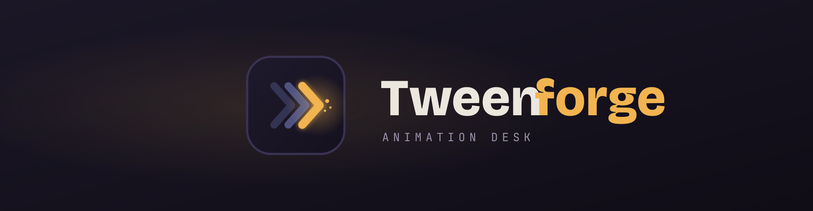

<p align="center">
  
</p>

<p align="center">
  <em>Self-hosted control desk for automated, faceless 2D-animated explainer videos.</em>
</p>

<p align="center">
  
  
  
  
</p>

---

Tweenforge is the cockpit for a daily-video pipeline: you give it a theme or a
topic, set your style and characters, and it drafts a scene-by-scene storyboard
you review and flag. The output is a clean **manifest** — the spec your render
backend turns into a finished video.

It is the *planning and review* layer. It does not render video itself; the
heavy lifting (image generation, voiceover, animation, encoding, upload) runs on
your own GPU box, driven by the manifest Tweenforge produces.

---

## What it does

Five layers, top to bottom:

1. **Brief** — start from a recurring channel theme or a one-off topic.
2. **Variables** — visual style, recurring **characters** (with a locked look
   spec, reference image, and seed for consistency), time & place, and duration.
3. **Script** — generate the narration and per-scene art prompts with an LLM, or
   **import** a script you already wrote (split into scenes, wording kept verbatim).
4. **Storyboard** — every scene as a cel with its timecode; flag changes per
   scene (regenerate art, rewrite line, retime, change motion) with notes.
5. **Handoff** — export a **manifest** (builds the video) and an **edits** list
   (re-renders only the scenes you flagged).

Pluggable model providers: OpenAI, Anthropic, **Ollama (local)**, OpenRouter, or
any OpenAI-compatible endpoint (vLLM, LM Studio, LocalAI). Pick one in Settings.

---

## Stack

- React + Vite. No backend required to run the dashboard.
- Projects and provider settings persist in the browser's `localStorage`.
- Custom CSS (no Tailwind build step), Google Fonts via `@import`.

---

## Quick start (development)

Requires **Node.js 18+**.

```bash
git clone https://github.com/rpoltera/Tweenforge.git
cd Tweenforge
npm install
npm run dev
```

Open <http://localhost:5173> (or `http://<host-ip>:5173` from another machine).

### Production build

```bash
npm run build      # static bundle in ./dist
npm run preview    # serve ./dist to check it
```

Serve `./dist` with nginx or `serve` behind a systemd unit for a long-running deploy.

---

## Deploy to a Proxmox LXC

The installer is **self-contained** — the app is embedded inside it, so the only
file the repo needs for deployment is `install-tweenforge-lxc.sh`. On the Proxmox
host, as root, one command does everything:

```bash
curl -fsSL https://raw.githubusercontent.com/rpoltera/Tweenforge/main/install-tweenforge-lxc.sh | bash
```

It runs directly — nothing is saved or opened, and there are no folders to upload.
The script **auto-detects** your container storage, your Debian template
(downloading one if none is present), and your network bridge; picks the next free
container ID; creates the LXC; installs Node; unpacks and builds the bundled app;
and registers a systemd service that auto-starts on boot. It prints the container
ID and the URL when it finishes.


---

## Connect a model

Click the provider button in the top bar → **API & models**.

- **Fully local:** choose **Ollama**, set the base URL to your box
  (`http://<ollama-host>:11434/v1`) and the model you've pulled
  (`ollama pull qwen2.5:14b`). Ollama must allow the browser origin — start it
  with `OLLAMA_ORIGINS="*"` on a trusted LAN if calls are blocked.
- **Hosted (OpenAI / Anthropic / OpenRouter):** browsers usually block direct
  calls (CORS) and a key in the browser is exposed. Route these through a backend
  in production rather than calling them from the page.

## Make a video

The installer also sets up the **render engine** (a small service on the same box).
In the app, open **Settings** and set the **Render service URL** to
`http://<container-ip>:8080`, then click **Render video** in the Handoff layer.

The engine reads the manifest and produces an MP4: voiceover (TTS) -> a visual per
scene -> Ken Burns motion -> ffmpeg encode. Out of the box, scenes render as clean
typographic motion cards, so you get a finished video immediately. Point it at a
Stable Diffusion endpoint (`SD_URL`) for AI art, and set `USE_NVENC=1` on a
GPU-passthrough container to encode on the P40s.

---

## Where this fits the pipeline

```
Tweenforge (this repo)            Render backend (separate, your GPU box)
─────────────────────            ────────────────────────────────────────
brief + variables                reads manifest →
  → script / storyboard            LLM narration (if generated locally)
  → review + flags                 TTS voiceover
  → manifest.json  ───────────►    SDXL / ComfyUI art (per scene + characters)
  → edits.json     ───────────►    motion + ffmpeg (h264_nvenc)
                                   thumbnail + metadata
                                   YouTube upload
```

The render backend is not part of this repo yet — it's the next build.

---

## Limits & notes

- Data lives in the browser's `localStorage`, not on the server. Clearing site
  data wipes your projects and provider settings.
- Tweenforge produces specs; it does not generate or upload media on its own.
- For a monetizable channel, keep a human in the loop. Fully templated, fully
  automated daily uploads are the pattern platforms most aggressively penalize.

---

## License

MIT (suggested — set as you prefer).
